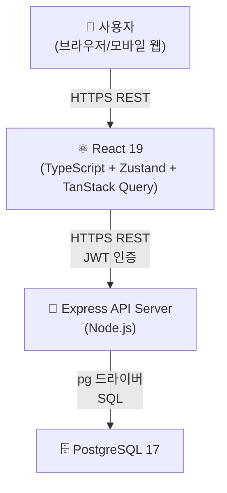
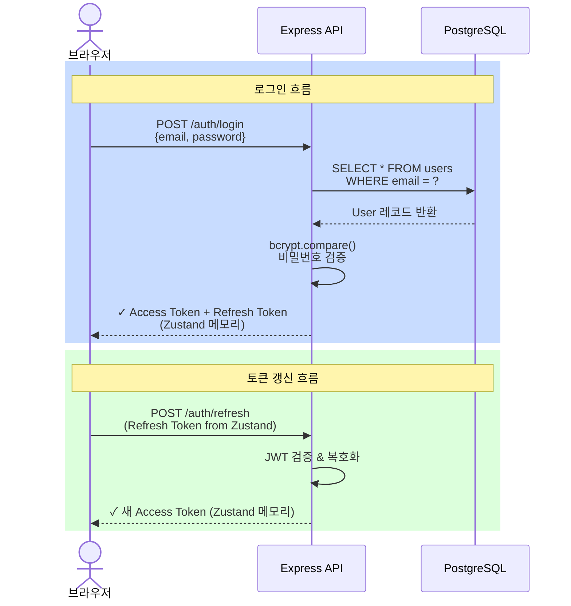
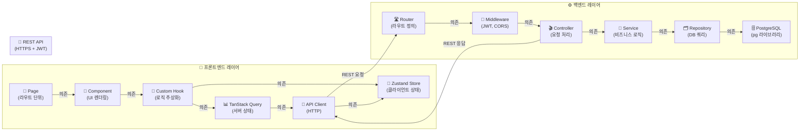

# 기술 아키텍처 다이어그램 - TodoListApp

**작성일:** 2026-05-13  
**버전:** 1.0

---

## 변경 이력

| 버전 | 날짜 | 작성자 | 변경 내용 |
|------|------|--------|----------|
| 1.0 | 2026-05-13 | yoseb lee | 최초 작성 — 전체 시스템 구성, 인증 흐름, 레이어 아키텍처 다이어그램 |
| 1.1 | 2026-05-13 | yoseb lee | 인증 방식 변경 — Refresh Token 저장 위치를 httpOnly Cookie → Zustand 메모리로 변경 |

---

## 1. 전체 시스템 구성

**설명:** 사용자는 반응형 웹 인터페이스를 통해 상호작용하며, 프론트엔드는 HTTPS REST API로 백엔드와 통신합니다. 백엔드는 pg 라이브러리를 사용하여 PostgreSQL 데이터베이스에 직접 접근합니다.

---

## 2. 인증 흐름

**설명:** 로그인 시 이메일/비밀번호로 사용자를 검증하고 Access Token(15분)과 Refresh Token(7일)을 발급하여 모두 Zustand 메모리에 저장합니다. Access Token 만료 시 Zustand의 Refresh Token으로 자동 갱신합니다.

---

## 3. 레이어 아키텍처

**설명:** 프론트엔드는 Page에서 시작해 Component → Custom Hook → TanStack Query → API Client 순서로 단방향 의존합니다. 백엔드는 Router에서 시작해 Middleware → Controller → Service → Repository → PostgreSQL 순서로 계층화됩니다.

---

## 3.1 프론트엔드 레이어 역할

| 레이어 | 책임 | 예시 |
|--------|------|------|
| **Page** | 라우트 단위 페이지 구성, 레이아웃 | `/todos`, `/login` |
| **Component** | UI 렌더링, 사용자 입력 수신 | `<TodoList />`, `<Button />` |
| **Custom Hook** | 로직 추상화, 상태 관리 | `useFetchTodos()`, `useAddTodo()` |
| **TanStack Query** | 서버 상태 동기화, 캐싱 | useQuery, useMutation |
| **API Client** | HTTP 요청 빌드 및 송신, 토큰 주입 | `apiClient.get()`, `apiClient.post()` |
| **Zustand Store** | 글로벌 클라이언트 상태 | `useAuthStore()` (토큰, 사용자 정보) |

---

## 3.2 백엔드 레이어 역할

| 레이어 | 책임 | 예시 |
|--------|------|------|
| **Router** | HTTP 메서드 및 엔드포인트 정의 | `GET /api/todos`, `POST /api/todos` |
| **Middleware** | 인증 검증, CORS, 에러 처리 | JWT 토큰 검증, 요청 로깅 |
| **Controller** | 요청 파라미터 파싱, 서비스 호출, 응답 구성 | HTTP 요청 수신 → 비즈니스 로직 호출 → JSON 응답 |
| **Service** | 핵심 비즈니스 로직, 검증, 도메인 규칙 | 할일 필터링, 카테고리 삭제 가능 여부 확인 |
| **Repository** | SQL 쿼리 빌드 및 실행 | `SELECT`, `INSERT`, `UPDATE`, `DELETE` |
| **PostgreSQL** | 데이터 저장 및 조회 | User, Category, Todo 테이블 |
