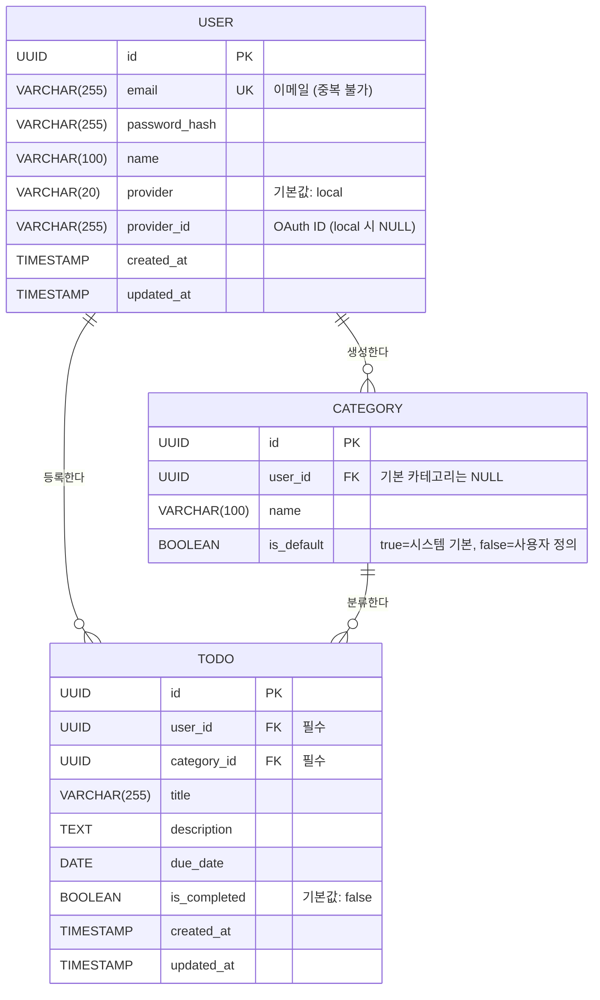

# ERD (Entity Relationship Diagram) - TodoListApp

**작성일:** 2026-05-13  
**버전:** 1.0  
**참조 문서:** 도메인 정의서 v1.1, PRD v1.2

---

## 변경 이력

| 버전 | 날짜 | 작성자 | 변경 내용 |
|------|------|--------|----------|
| 1.0 | 2026-05-13 | yoseb lee | 최초 작성 — 3개 엔티티(USER, CATEGORY, TODO) ERD, 관계 정의, 비즈니스 규칙 반영 |

---

## 1. ERD 다이어그램



---

## 2. 엔티티 상세

### 2.1 USER (사용자)

| 컬럼명 | 타입 | 제약조건 | 설명 |
|--------|------|---------|------|
| id | UUID | PK | 사용자 고유 식별자 |
| email | VARCHAR(255) | UNIQUE, NOT NULL | 로그인 식별자 (이메일 중복 불가) |
| password_hash | VARCHAR(255) | NOT NULL | bcrypt 해시된 비밀번호 |
| name | VARCHAR(100) | NOT NULL | 사용자 이름 |
| provider | VARCHAR(20) | NOT NULL, DEFAULT 'local' | 인증 제공자 (local / google / facebook 등) |
| provider_id | VARCHAR(255) | NULL | OAuth 제공자의 사용자 ID (local 인증 시 NULL) |
| created_at | TIMESTAMP | NOT NULL, DEFAULT NOW() | 회원가입 일시 |
| updated_at | TIMESTAMP | NOT NULL, DEFAULT NOW() | 정보 수정 일시 |

**비즈니스 규칙:**
- BR-01: 모든 기능은 인증된 사용자만 사용 가능 (User를 통한 인증 필수)
- BR-07: email은 중복 등록 불가 (UNIQUE 제약)
- BR-09: 가입 후 email 변경 불가 (로그인 식별자 고정)
- BR-02: 사용자는 자신의 데이터만 조회·수정·삭제 가능

---

### 2.2 CATEGORY (카테고리)

| 컬럼명 | 타입 | 제약조건 | 설명 |
|--------|------|---------|------|
| id | UUID | PK | 카테고리 고유 식별자 |
| user_id | UUID | FK → USER.id, NULL | 카테고리 소유자 (기본 카테고리는 NULL) |
| name | VARCHAR(100) | NOT NULL | 카테고리 이름 |
| is_default | BOOLEAN | NOT NULL, DEFAULT false | 기본/사용자 정의 여부 |

**비즈니스 규칙:**
- BR-03: 기본 카테고리는 시스템 제공 (is_default=true, user_id=NULL)
- BR-04: 사용자 정의 카테고리는 해당 사용자에게만 귀속 (is_default=false, user_id NOT NULL)
- BR-08: 할일이 1개 이상 속한 카테고리는 삭제 불가

**기본 카테고리 (시스템이 초기화):**
- 업무 (Work)
- 개인 (Personal)
- 기타 (Others)

---

### 2.3 TODO (할일)

| 컬럼명 | 타입 | 제약조건 | 설명 |
|--------|------|---------|------|
| id | UUID | PK | 할일 고유 식별자 |
| user_id | UUID | FK → USER.id, NOT NULL | 할일 소유자 |
| category_id | UUID | FK → CATEGORY.id, NOT NULL | 할일 분류 카테고리 |
| title | VARCHAR(255) | NOT NULL | 할일 제목 |
| description | TEXT | NULL | 할일 상세 설명 |
| due_date | DATE | NULL | 종료 예정일 |
| is_completed | BOOLEAN | NOT NULL, DEFAULT false | 완료 여부 (true=완료, false=미완료) |
| created_at | TIMESTAMP | NOT NULL, DEFAULT NOW() | 할일 등록 일시 |
| updated_at | TIMESTAMP | NOT NULL, DEFAULT NOW() | 할일 수정 일시 |

**비즈니스 규칙:**
- BR-05: 할일 등록 시 카테고리 필수 지정 (category_id NOT NULL)
- BR-06: 할일 목록은 카테고리, 종료 예정일 기간, 완료 여부로 필터링 가능
- BR-02: 사용자는 자신의 할일만 조회·수정·삭제 가능 (user_id 기반 접근 제어)

---

## 3. 관계 정의

### 3.1 User → Category 관계 (1:N)

| 속성 | 값 |
|------|-----|
| 관계명 | "생성한다" |
| 카디널리티 | 1 : 0..N |
| 외래키 | CATEGORY.user_id → USER.id |
| 설명 | 한 명의 User는 0개 이상의 사용자 정의 카테고리를 생성한다. 기본 카테고리는 user_id=NULL로 모든 사용자가 공유한다. |

---

### 3.2 User → Todo 관계 (1:N)

| 속성 | 값 |
|------|-----|
| 관계명 | "등록한다" |
| 카디널리티 | 1 : 0..N |
| 외래키 | TODO.user_id → USER.id |
| 설명 | 한 명의 User는 0개 이상의 할일(Todo)을 등록한다. 모든 할일은 특정 사용자에게 귀속된다. |

---

### 3.3 Category → Todo 관계 (1:N)

| 속성 | 값 |
|------|-----|
| 관계명 | "분류한다" |
| 카디널리티 | 1 : 0..N |
| 외래키 | TODO.category_id → CATEGORY.id |
| 설명 | 하나의 Category는 0개 이상의 할일(Todo)을 포함한다. 모든 할일은 반드시 하나의 카테고리에 분류되어야 한다 (NOT NULL). |

---

## 4. 비즈니스 규칙과 ERD 반영

### 4.1 인증 및 접근 제어 (BR-01, BR-02)

**ERD 반영:**
- 모든 엔티티(CATEGORY, TODO)는 USER와의 관계를 통해 소유권(ownership)을 표현한다.
- TODO와 사용자 정의 CATEGORY는 user_id 외래키로 사용자를 명시적으로 참조한다.
- 애플리케이션 계층에서 user_id 검증을 통해 자신의 데이터만 접근 가능하도록 구현한다.

---

### 4.2 기본 카테고리 설계 (BR-03, BR-04)

**ERD 반영:**
- CATEGORY.user_id는 NULL 허용 (기본 카테고리용)
- CATEGORY.is_default 플래그로 기본/사용자 정의 구분
  - is_default=true AND user_id=NULL: 시스템 기본 카테고리
  - is_default=false AND user_id NOT NULL: 사용자 정의 카테고리
- 애플리케이션 시작 시 기본 카테고리 3개(업무, 개인, 기타)를 DB에 초기화한다.

---

### 4.3 할일 카테고리 필수 (BR-05)

**ERD 반영:**
- TODO.category_id는 NOT NULL 제약으로 반드시 카테고리를 지정하도록 강제한다.
- 할일 등록 시 카테고리 드롭다운에서 기본 카테고리 + 사용자 정의 카테고리 중 선택 필수.

---

### 4.4 카테고리 삭제 제약 (BR-08)

**ERD 반영:**
- CATEGORY 테이블 자체에는 제약이 없으나, 비즈니스 로직에서 다음을 검증한다:
  - 카테고리 삭제 요청 시 `SELECT COUNT(*) FROM TODO WHERE category_id = ?` 쿼리로 해당 카테고리에 속한 할일 개수를 확인한다.
  - 할일이 1개 이상 존재하면 삭제 거부 (오류 메시지: "카테고리에 할일이 있어서 삭제할 수 없습니다")
  - 기본 카테고리(is_default=true)는 삭제 불가 (별도 검증)

---

### 4.5 이메일 중복 및 변경 불가 (BR-07, BR-09)

**ERD 반영:**
- USER.email은 UNIQUE 제약으로 중복 등록 방지 (BR-07)
- email은 읽기 전용으로 설계 (애플리케이션에서 수정 불가 처리)
- 회원가입 시 입력, 그 이후 변경 불가능

---

### 4.6 필터링 및 정렬 (BR-06)

**ERD 반영:**
- TODO의 다음 컬럼들이 필터링 기준이 된다:
  - category_id: 특정 카테고리의 할일만 조회
  - due_date: 기간(from~to) 범위의 할일만 조회
  - is_completed: 완료/미완료 상태 필터
- 정렬:
  - 기본: created_at DESC (최신 등록순)
  - 선택: due_date ASC (마감일 순)

---

## 5. 주요 설계 결정사항

### 5.1 NULL 허용 정책

| 컬럼 | NULL 허용 | 사유 |
|------|-----------|------|
| USER.provider_id | O | OAuth 미사용(local 인증) 시 NULL |
| CATEGORY.user_id | O | 기본 카테고리는 모든 사용자 공유(user_id=NULL) |
| TODO.description | O | 할일 설명은 선택 사항 |
| TODO.due_date | O | 마감일 없는 할일도 등록 가능 |

### 5.2 타입 선택 사유

| 컬럼 | 타입 | 사유 |
|------|------|------|
| id | UUID | 분산 시스템 대비, 데이터 병합 안전성 |
| email | VARCHAR(255) | RFC 5321 이메일 최대 길이 고려 |
| password_hash | VARCHAR(255) | bcrypt 해시 길이(60자) + 여유 |
| name | VARCHAR(100) | 일반적인 이름 길이 | 
| provider | VARCHAR(20) | 'local', 'google', 'facebook' 등 충분함 |
| provider_id | VARCHAR(255) | OAuth 제공자별 ID 길이 편차 대응 |
| category_name | VARCHAR(100) | 사용자 친화적 길이 |
| title | VARCHAR(255) | 할일 제목 적절 길이 |
| description | TEXT | 상세 설명 용량 무제한 |
| due_date | DATE | 날짜만 필요(시간 불필요) |
| is_completed | BOOLEAN | 이진 상태 표현 |
| timestamp | TIMESTAMP | 감사추적(audit trail)용 정밀도 |

### 5.3 인덱스 설계 (권장)

| 테이블 | 컬럼 | 인덱스명 | 사유 |
|--------|------|---------|------|
| USER | email | idx_user_email | 로그인 쿼리 성능 |
| CATEGORY | user_id | idx_category_user_id | 사용자별 카테고리 조회 |
| TODO | user_id | idx_todo_user_id | 사용자별 할일 조회 |
| TODO | category_id | idx_todo_category_id | 카테고리 삭제 시 할일 개수 확인 |
| TODO | user_id, category_id | idx_todo_user_category | 필터링 복합 쿼리 최적화 |

---

## 6. 데이터 일관성 전략

### 6.1 Referential Integrity (참조 무결성)

```sql
-- CATEGORY 테이블
ALTER TABLE CATEGORY
ADD CONSTRAINT fk_category_user_id
FOREIGN KEY (user_id) REFERENCES USER(id);

-- TODO 테이블
ALTER TABLE TODO
ADD CONSTRAINT fk_todo_user_id
FOREIGN KEY (user_id) REFERENCES USER(id)
ON DELETE CASCADE;  -- 사용자 삭제 시 할일 자동 삭제

ALTER TABLE TODO
ADD CONSTRAINT fk_todo_category_id
FOREIGN KEY (category_id) REFERENCES CATEGORY(id);
```

### 6.2 Cascade Delete 정책

| 시나리오 | 정책 | 사유 |
|---------|------|------|
| 사용자 삭제 → TODO 삭제 | ON DELETE CASCADE | 데이터 보존 정책: 회원 탈퇴 시 모든 데이터 즉시 삭제 |
| 사용자 삭제 → CATEGORY 삭제 | ON DELETE CASCADE | 사용자 정의 카테고리는 해당 사용자에게만 귀속 |
| 카테고리 삭제 → TODO 유지 | NO ACTION | BR-08: 할일이 있는 카테고리는 삭제 불가 |

---

## 7. 마이그레이션 시 초기 데이터

### 기본 카테고리 초기화 (시드 데이터)

```sql
-- 기본 카테고리 생성 (모든 사용자가 공유)
INSERT INTO CATEGORY (id, user_id, name, is_default)
VALUES
  (uuid_generate_v4(), NULL, '업무', true),
  (uuid_generate_v4(), NULL, '개인', true),
  (uuid_generate_v4(), NULL, '기타', true);
```

---

## 참고 자료

- **도메인 정의서:** `C:\_vibe\todolist-app\docs\1-domain-definition.md` (v1.1)
- **PRD:** `C:\_vibe\todolist-app\docs\2-prd.md` (v1.2)
- **기술 스택:** Node.js + Express, PostgreSQL 17, pg 라이브러리
- **데이터 보존:** Hard Delete 정책 (소프트 삭제 미적용)
