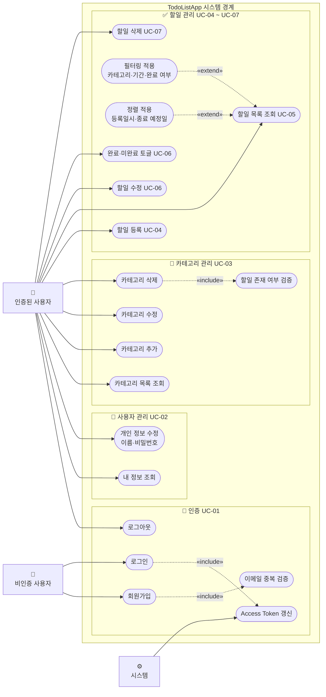

# 유스케이스 다이어그램 - TodoListApp

**작성일:** 2026-05-13  
**버전:** 1.0  
**참조 문서:** PRD v1.1, 도메인 정의서 v1.0

---

## 액터 정의

| 액터 | 설명 |
|------|------|
| 비인증 사용자 | 회원가입·로그인 전 상태의 사용자 |
| 인증된 사용자 | 로그인하여 JWT를 보유한 사용자 |
| 시스템 | 자동으로 실행되는 내부 처리 (토큰 갱신, 검증 등) |

---

## 유스케이스 다이어그램

---

## include / extend 관계 설명

### «include» — 항상 실행되는 포함 관계

| 기본 유스케이스 | 포함 유스케이스 | 설명 |
|----------------|----------------|------|
| 회원가입 | 이메일 중복 검증 | 가입 시 항상 이메일 중복 여부를 검증한다 (BR-07) |
| 로그인 | Access Token 갱신 | 로그인 성공 시 항상 Access Token + Refresh Token을 발급한다 |
| 카테고리 삭제 | 할일 존재 여부 검증 | 삭제 전 항상 연관 할일 존재 여부를 확인한다 (BR-08) |

### «extend» — 조건부로 실행되는 확장 관계

| 확장 유스케이스 | 기본 유스케이스 | 조건 |
|----------------|----------------|------|
| 필터링 적용 | 할일 목록 조회 | 사용자가 카테고리·기간·완료 여부 필터를 설정한 경우 (BR-06) |
| 정렬 적용 | 할일 목록 조회 | 사용자가 기본 정렬(등록일시) 외 정렬 기준을 선택한 경우 |

---

## 액터별 유스케이스 요약

| 액터 | 접근 가능한 유스케이스 |
|------|----------------------|
| 비인증 사용자 | 회원가입, 로그인 |
| 인증된 사용자 | 로그아웃, 내 정보 조회, 개인 정보 수정, 카테고리 전체 관리, 할일 전체 관리 |
| 시스템 | Access Token 자동 갱신, 이메일 중복 검증, 할일 존재 여부 검증 |
